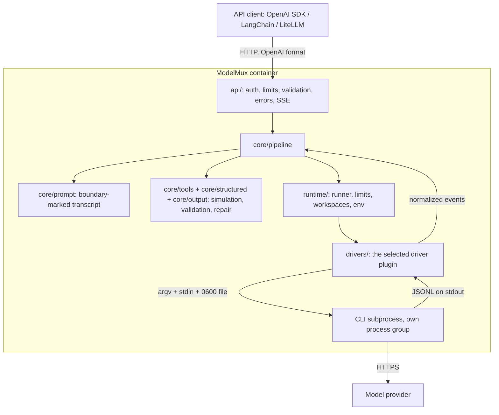

# Architecture



## Layers and their rules

| Package | Owns | Must not |
|---|---|---|
| `api/` | HTTP: routes, auth, middleware, request schemas, error rendering, SSE framing | know anything CLI-specific |
| `core/` | one request end to end: prompt rendering, tool/format simulation, repair, usage, streaming logic | parse CLI output or spawn processes |
| `runtime/` | processes: the **only** module that spawns (`runner.py`), limits, workspaces, environment | interpret CLI output |
| `drivers/` | one package per CLI: invocation, output parsing, exit classification, probe | contain HTTP logic or spawn processes |
| `observability/` | JSON logs, redaction, metrics | — |

Enforced by a ruff banned-API rule and `tests/security/test_source_scan.py`
(no shells anywhere; only `runtime/runner.py` may create processes).

## Request lifecycle

1. **Middleware** assigns the request ID (`X-Request-ID`, or a new one), caps
   the body while it is read, and writes the access log.
2. **Route**: bearer auth → `Content-Type` check → JSON parse → schema
   validation → parameter rules (§6.3) → model allowlist.
3. **Pipeline**: tool policy and response format are validated → messages are
   rendered into a system prompt and a transcript with a per-request random
   boundary → size limit.
4. **Runtime**: wait for a concurrency slot (bounded queue) → create an empty
   `0700` workspace → the driver builds the invocation → spawn in a new
   session with a from-scratch environment → write the prompt to stdin.
5. **Events**: each stdout line → `driver.parse_line` → normalized events.
   A `ToolAttempt` kills the process group at once (`sandbox_violation`).
6. **Result**: classify the run (see [ERRORS.md](ERRORS.md#which-error-wins))
   → interpret the text (tool calls / structured output / plain text) → at
   most one repair run → OpenAI response or SSE chunks.
7. **Cleanup** in `finally`, on every path: kill and reap the process group,
   remove the workspace, release the slot.

## The driver contract

Drivers translate; they never execute. See [WRITING_A_DRIVER.md](WRITING_A_DRIVER.md).

```
DriverRequest(cli_model, system_prompt, transcript, workspace, request_id)
        │ build_invocation()
        ▼
Invocation(argv, stdin, env, files)  ──runtime──▶  stdout lines
                                                        │ parse_line()
                                                        ▼
TextDelta | TextFinal | ToolAttempt | UsageReport | Completed | ProviderFailure | Ignored
```

## Process supervision

- `start_new_session=True`: the CLI leads its own process group.
- Output is read in chunks and split into lines, with a per-line and a total
  cap; stderr is drained continuously into a 16 KiB ring buffer; stdin is
  written in the background so a large prompt cannot deadlock.
- Timeouts: first output line, idle between lines (measured only while
  waiting, so slow consumers do not count), and total wall clock.
- asyncio's `Process.wait()` only returns once every pipe is closed, which a
  leftover child can prevent. The runner watches `returncode` instead, drains
  what is left in the pipe briefly, then treats stdout as closed.
- Kill: SIGTERM to the group, SIGKILL after `KILL_GRACE`, and SIGKILL to the
  group even after a clean exit to remove stragglers. The kill runs in a
  shielded task; the run's cleanup waits for it **even if the request task is
  cancelled**, so the workspace is never removed and the slot never released
  while the CLI is still alive.

## Streaming and disconnects

Starlette cancels a streaming response through an anyio cancel scope, which
cancels *every* await inside it. The pipeline stream therefore runs in its own
asyncio task (`StreamPump` in `api/routes_chat.py`): a disconnect cancels it
exactly once, and the runner's cleanup completes. The route waits for the first
piece before sending headers, so early failures are ordinary HTTP errors.

Requests with tools or a non-text `response_format` are buffered: the answer is
validated (and repaired if needed) before the first byte is sent.

## Tool simulation

The system prompt lists the offered tools and tells the model to reply with
only `{"tool_calls": [{"name": ..., "arguments": {...}}]}` or plain text.
ModelMux parses the reply without trusting it: fences are stripped, the first
balanced JSON object is extracted, names must be offered, arguments must
validate against the tool's JSON Schema (Draft 2020-12) and size limit, and
`tool_choice` / `parallel_tool_calls` must be respected. Invalid output gets
one repair run that quotes the specific error; after that, `502`.

## Decisions (differences from the original plan)

Recorded so the reasoning is not lost. Each was agreed during the build.

| Topic | Decision | Why |
|---|---|---|
| Probing lockdown flags | The probe runs the CLI with every lockdown flag and empty stdin and requires the "no input" error; an unknown flag fails. Codex config keys are proven one by one with invalid values | Claude's `--max-turns` and `--system-prompt-file` are hidden from `--help`; Codex ignores unknown `-c` keys silently |
| Startup failures | Fail fast: any probe failure (including a live "say ok" request) exits the process. No "start not-ready and retry" loop; `PROBE_INTERVAL` removed | The CLI and its flags cannot change inside an immutable, read-only container |
| Credentials | Provider keys in the environment are never forwarded; the CLI logs in inside its driver-home volume | Keeps secrets out of ModelMux's environment and process tree |
| Codex system prompt | Passed with `-c model_instructions_file=<0600 file>`, which replaces Codex's built-in agent instructions, instead of being prepended to stdin | Stronger isolation from Codex's agent behaviour |
| `CODEX_HOME` | Not set; Codex uses `$HOME/.codex` with `HOME` = driver home | Mirrors Claude (`$HOME/.claude`) |
| Model lists | Claude: aliases and full IDs including `fable`; Codex: the three current models from the official docs | Chosen by the maintainer; override with `MODELMUX_MODELS` |
| Extra error codes | `not_found` (404) and `method_not_allowed` (405) | Unknown routes must also return the OpenAI error shape |
| `Content-Type` check | A route dependency after auth, not middleware | Unauthenticated callers always get 401 first |
| Stop sequences | Applied to plain-text answers only, never to tool-call or schema JSON | Truncating JSON would corrupt it |
| Server start | `python -m modelmux` runs uvicorn (1 worker, no server header, proxy headers only from `MODELMUX_TRUSTED_PROXIES`) | One place to derive uvicorn options from settings |
| Compose network | A dedicated bridge network, not an `internal` one | `internal` networks block the egress the CLIs need; egress restriction is documented |
| Vulnerability gate | Fail on fixable HIGH/CRITICAL (`--ignore-unfixed`), with `.trivyignore` for justified exceptions | Unfixed base-image CVEs cannot be acted on |
| Codex streaming | The whole message arrives as one chunk | Codex reports only completed agent messages |
